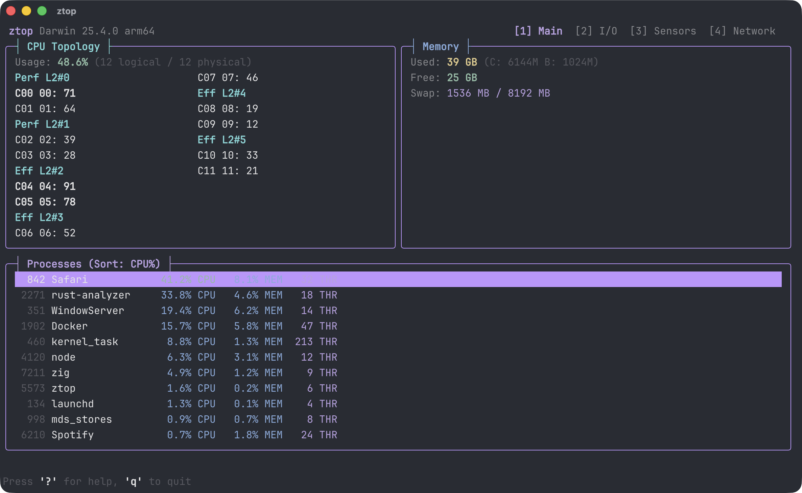

# ztop

<p align="center">
    
</p>

`ztop` is a terminal system monitor for macOS and Linux. It gives you a fast, keyboard-driven view of CPU load, memory pressure, disk and network throughput, hardware sensors, GPU activity, battery status, and the busiest processes without leaving the shell.

It is built for people who want a focused dashboard in the terminal: quick enough to keep open all day, detailed enough to answer "what is using this machine right now?", and interactive enough to act on what you find.

## What ztop is useful for

- Spot CPU spikes and per-core imbalance at a glance
- See how logical CPUs map onto physical cores, shared cache groups, and heterogeneous core clusters
- See memory pressure, swap use, cache, and buffers without opening multiple tools
- Watch disk and network throughput in real time
- Watch supported GPUs for utilization, memory use, power, and temperature
- Check thermal and battery data from the same screen
- Find heavy processes quickly, sort them different ways, and filter by name or PID
- Terminate a selected process directly from the UI
- Surface zombie processes and jump to their parent processes

## Features

- Four focused views:
  - `Main` for CPU, memory, and process activity
  - `I/O` for disk and network throughput plus per-process disk rates
  - `Sensors` for thermal, battery, and GPU information
  - `Network` for active connections and interface totals
- Live process table with sorting by CPU, memory, PID, or name
- Main view CPU topology map that groups logical threads by physical core and cache/cluster domain when the platform exposes it
- Live GPU monitoring on supported hardware:
  - NVIDIA via NVML when `libnvidia-ml` is present
  - AMD via DRM/sysfs counters exposed by `amdgpu`
  - Apple Silicon via IORegistry accelerator performance statistics
- Keyboard-first navigation with fast filtering and command mode
- Built-in process actions:
  - Send `SIGTERM` or `SIGKILL` to the selected process
  - `:killall <name>` to send `SIGTERM` to matching processes
  - `:show zombie` to switch the process table to zombie parent processes
  - `:search <term>` to jump into filtering from command mode
- Responsive layout that adapts to narrow terminals
- Configurable refresh interval, default sort, theme, and color overrides
- Included themes: `default`, `gruvbox`, `nord`, `solarized`, `catppuccin`
- Runs on both macOS and Linux

## Quick Start

`ztop` currently builds from source with Zig.

```bash
zig build
zig build run
```

Requirements:

- Zig `0.16.0` or newer
- A real terminal/TTY for `zig build run`

To run the test suite:

```bash
zig build test
```

## Using ztop

Common keys:

| Key                     | Action                                                 |
| ----------------------- | ------------------------------------------------------ |
| `1`, `2`, `3`, `4`      | Switch between `Main`, `I/O`, `Sensors`, and `Network` |
| `j` / `k` or arrow keys | Move through the process list                          |
| `c`, `m`, `p`, `n`      | Sort by CPU, memory, PID, or name                      |
| `/`                     | Filter processes by name or PID                        |
| `:`                     | Open command mode                                      |
| `t`                     | Send `SIGTERM` to the selected process                 |
| `K`                     | Send `SIGKILL` to the selected process                 |
| `Esc`                   | Clear filters, status messages, and zombie-parent view |
| `?`                     | Open help                                              |
| `q`                     | Quit                                                   |

Command mode examples:

```text
:show zombie
:killall chrome
:search postgres
```

## Configuration

If present, `ztop` reads configuration from:

- `$XDG_CONFIG_HOME/ztop.cfg`
- `~/.config/ztop.cfg`

Example:

```ini
theme = nord
default_sort = cpu
default_tab = network
default_tree_view = false
show_help_on_startup = false
update_interval_ms = 500
color.tab_active = bright_cyan
```

This lets you set a preferred theme, choose the initial tab and process sort, start in tree view, open the help overlay on launch, adjust refresh speed, and override individual UI colors.

Additional startup options:

- `default_tab = main|io|sensors|network` (or `1` through `4`)
- `default_tree_view = true|false`
- `show_help_on_startup = true|false`

Boolean values also accept `yes`/`no` and `1`/`0`.
