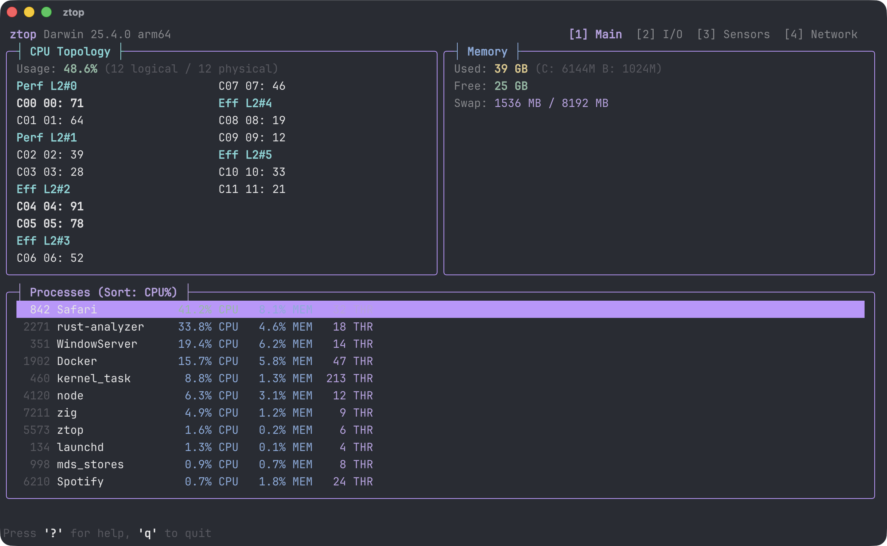

# ztop


<p align="center">
    
</p>

`ztop` is a terminal system monitor for macOS. It gives you a fast, keyboard-driven view of CPU load, memory pressure, disk and network throughput, hardware sensors, GPU activity, battery status, and the busiest processes — without leaving the shell.

Built for people who want a focused dashboard in the terminal: quick enough to keep open all day, detailed enough to answer "what is using this machine right now?", and interactive enough to act on what you find.

## Features

- Five focused views: `Main`, `I/O`, `Sensors`, `Network`, and `Diagnostics`
- Live process table with sorting, filtering, tree view, and per-thread drill-down
- CPU topology map grouping logical threads by physical core, cache domain, and heterogeneous cluster
- GPU monitoring on Apple Silicon via IORegistry accelerator performance statistics
- Dynamic process-table columns with an in-app picker (PID, PPID, state, CPU, memory, threads, disk rates, wakeups/churn, launch path, energy)
- Mouse support for tab switching, list navigation, and scrolling
- Timeline scrubbing with incident bookmarks and before/after diff: pause live view, scrub through recent history, drop markers to jump back to interesting moments, and compare two captured snapshots side-by-side
- **Why is this busy?** — ranked explanation view showing which processes are driving the current CPU, memory, disk, network, or wakeup-churn spike, with delta indicators against a 5-tick baseline
- **Wakeup attribution** (`u` sort + optional `wakeups` column) — surfaces timer wakeups and scheduler churn (`W` wakeups/sec, `C` context-switches/sec), including low-CPU/high-churn workloads
- **Resource causality graph** (`g`) — per-process view linking a selected process to its child tree, open network connections, and a resource summary
- **Diagnostics tab** (`5`) — pressure root-cause hints (swap storms, runaway log writers, reconnect loops, file descriptor pressure, memory leak suspects, CPU runaways, thermal throttle risk, cache starvation) alongside the why-busy ranked spike analysis; supports on-device **Apple Intelligence diagnosis** triggered via the `Tab` key
- **Process lifeline view** (`L`) — high-fidelity timeline for a selected process showing state transitions, CPU bursts, memory growth, thread count changes, and socket opens/closes over time
- **Build/test pipeline lens** (`P`) — groups compiler, linker, and test-runner processes under their root build orchestrator with aggregated and per-process CPU, memory, and disk I/O metrics
- Built-in process actions: `SIGTERM`, `SIGKILL`, `:killall`, `:show zombie`, `:search`
- Process follow mode (`f`): lock the view to a selected process as it moves through the list
- Responsive layout for narrow terminals
- Configurable refresh interval, default sort, theme, and per-color overrides
- Themes: `default`, `default_dark`, `default_light`, `gruvbox`, `nord`, `solarized`, `catppuccin`, `palenight`, `colorblind`

## Installation

### Homebrew (macOS)

```bash
brew tap ADJB1212/ztop
brew install ztop
```

### Build from Source

**Requirements:** Zig `0.16.0` or newer, macOS (ARM / Apple Silicon), a POSIX terminal.

```bash
git clone https://github.com/ADJB1212/ztop.git
cd ztop
zig build -Doptimize=ReleaseFast
```

The binary is written to `zig-out/bin/ztop`. Copy it anywhere on your `PATH`:

```bash
cp zig-out/bin/ztop ~/.local/bin/
```

To run directly without installing:

```bash
zig build run
```

To run the test suite:

```bash
zig build test
```

## Usage

```
ztop [--version]
```

### Key Bindings

| Key                     | Action                                                                     |
| ----------------------- | -------------------------------------------------------------------------- |
| `1`, `2`, `3`, `4`, `5` | Switch to `Main`, `I/O`, `Sensors`, `Network`, `Diagnostics`               |
| `Tab`                   | Trigger on-device Apple Intelligence diagnosis (when on `Diagnostics` tab) |
| `j` / `k` or arrow keys | Move through the process list                                              |
| `Enter`                 | Drill into threads of the selected process                                 |
| `Esc`                   | Return from any view; clear follow, filter, status, or zombie view         |
| `c`, `m`, `p`, `n`, `u` | Sort by CPU, memory, PID, name, or wakeups/churn                           |
| `r`, `w`                | Sort by disk read or disk write (I/O tab only)                             |
| `C`                     | Toggle process-table columns for the current view                          |
| `v`                     | Toggle tree view (process hierarchy)                                       |
| `/`                     | Filter processes by name or PID                                            |
| `:`                     | Open command mode                                                          |
| `f`                     | Follow selected process (lock view to it as it moves)                      |
| `L`                     | Process lifeline view for selected process (timeline of events)            |
| `P`                     | Build/test pipeline lens (groups build processes by orchestrator)          |
| `g`                     | Resource causality graph for selected process (children + connections)     |
| `T`                     | Toggle timeline scrubbing mode (requires enough collected history)         |
| `←` / `→`               | While scrubbing: move older/newer by one snapshot                          |
| `[` / `]`               | While scrubbing: jump older/newer by 10 snapshots                          |
| `b`                     | While scrubbing: drop a bookmark at the current position                   |
| `B`                     | While scrubbing: remove the nearest bookmark                               |
| `{` / `}`               | While scrubbing: jump to previous/next bookmark                            |
| `d`                     | While scrubbing: toggle diff view (set anchor, then navigate to compare)   |
| `t`                     | Send `SIGTERM` to the selected process                                     |
| `K`                     | Send `SIGKILL` to the selected process                                     |
| `?`                     | Open help overlay                                                          |
| `q`                     | Quit                                                                       |

While scrubbing is active, destructive process actions and view-mutating actions are disabled until you exit scrubbing.
Press `Esc` or `T` to leave scrubbing and return to live view.

Bookmarks persist for the session (up to 10). They appear as `▼` markers on the timeline bar. Use `b` to mark a moment of interest, `{`/`}` to hop between them, and `B` to remove the one nearest the cursor.

Press `d` while scrubbing to set a diff anchor at the current position. Then navigate to another moment — the view changes to a before/after comparison showing CPU, memory, disk, network, temperature deltas and the processes that changed the most. The anchor appears as `◆` on the timeline bar. Press `d` or `Esc` to exit the diff view.

### Command Mode

Press `:` to open command mode. Available commands:

```
:show zombie          Show zombie processes and jump to their parent
:killall <name>       Send SIGTERM to all processes matching <name>
:search <term>        Filter the process list by name or PID
:pid <n>              Jump to and select a process by PID
:signal <SIG> <name>  Send a signal to all processes matching <name> (STOP/CONT/HUP/INT/USR1/USR2/QUIT)
:renice <value> <name> Set nice value (-20 to 19) for all processes matching <name>
:interval <ms>        Override the refresh interval (e.g. :interval 250); use :interval reset to restore default
:top <n>              Limit the process list to the top N entries by current sort; use :top off to clear
:quit                 Quit ztop
```

## Diagnostic Views

### Why Is This Busy? (`w`)

Press `w` to open a ranked explanation of what is driving the current load. The view detects which resource is spiking (CPU, memory, disk, network, or wakeup churn), shows current metrics with delta indicators relative to a 5-tick baseline, and lists the top contributing processes sorted by their share of the spike. Wakeup mode is especially useful when CPU% is modest but wakeups/context switches are high. Works in live mode and in timeline scrubbing mode — when scrubbing, the view reflects the state at the current scrub position and highlights the nearest event type.

### Resource Causality Graph (`g`)

Press `g` with a process selected to open a causality view for that process. Shows:

- All child processes with their CPU and memory usage
- Active network connections (protocol, address, TCP state)
- A resource summary with CPU and memory meters, thread count, disk I/O rates, and the full launch command

### Process Lifeline View (`L`)

Press `L` with a process selected to open a high-fidelity timeline of its behavior. This view is updated live and tracks:

- **State Transitions**: Track when a process moves between running, sleeping, or stopped states.
- **Resource Spikes**: Detects CPU bursts (>20% change) and memory growth (>5% change) between ticks.
- **Thread Churn**: Shows when threads are spawned or exited.
- **Network Activity**: Lists socket opens and closes with protocol and address details.
- **Graphs**: Live sparklines for the process's CPU and memory history.

### Pressure Root-Cause Hints (Diagnostics tab)

Open the Diagnostics tab (`5`) to surface automatically detected pathological patterns from current system state. The top box shows pressure hints; each includes a severity level (`!!` critical, `!` warning), a description, and the most likely culprit process where applicable.

Patterns detected:

| Pattern               | Trigger                                                                               |
| --------------------- | ------------------------------------------------------------------------------------- |
| Swap storm            | Swap > 15% used and growing over the last 30 snapshots                                |
| Swap pressure         | Swap > 15% used (stable)                                                              |
| Runaway log writer    | Single process > 8 MB/s writes with a log-related name, or > 40% of total disk writes |
| Disk write storm      | Single process > 8 MB/s writes and > 40% of total disk writes                         |
| Reconnect loop        | Process with > 15 TIME_WAIT or CLOSE_WAIT connections                                 |
| FD pressure risk      | Process with > 400 threads (proxy for high file descriptor usage)                     |
| Memory leak suspect   | Process memory grew > 3pp over ~60 seconds while system memory > 50%                  |
| CPU runaway           | Single process > 85% CPU while system total > 70%                                     |
| Thermal throttle risk | CPU temperature ≥ 85 °C                                                               |
| Cache starvation      | Page cache < 5% of RAM while memory pressure > 80%                                    |

### Build/Test Pipeline Lens (`P`)

Press `P` (on tabs 1–3) to switch the process box into pipeline lens mode. `ztop` scans the live process list, identifies build orchestrators (`make`, `cargo`, `cmake`, `ninja`, `go`, `zig`, `npm`, `pytest`, and others), and groups their child processes underneath them.

Each group shows:

- **Root row** — orchestrator name and PID with aggregated CPU%, memory%, and disk I/O across all children
- **Child rows** — individual compiler, linker, test runner, or helper processes with a stage badge (`[compile]`, `[link]`, `[test]`, `[package]`, `[build]`) and per-process metrics

Navigate with `j`/`k` or arrow keys. Press `P` or `Esc` to return to the normal process list.

## Configuration

`ztop` reads configuration from `$XDG_CONFIG_HOME/ztop.cfg` or `~/.config/ztop.cfg` when present.

Example configuration file:

```ini
theme = palenight
default_sort = cpu
default_tab = main
default_tree_view = false
show_help_on_startup = false
update_interval_ms = 500
process_columns = pid,cpu,mem,threads,state,wakeups
io_process_columns = pid,disk_read,disk_write,ppid
color.tab_active = 141
enable_ai = true
```

### Configuration Reference

| Key                    | Values                                                                                                                                                               |
| ---------------------- | -------------------------------------------------------------------------------------------------------------------------------------------------------------------- |
| `theme`                | `default`, `default_dark`, `default_light`, `gruvbox`, `nord`, `solarized`, `catppuccin`, `palenight`, `colorblind`                                                  |
| `default_sort`         | `cpu`, `mem`, `pid`, `name`, `wakeups`                                                                                                                               |
| `default_tab`          | `main`, `io`, `sensors`, `network`, `diagnostics` (or `1`–`5`)                                                                                                       |
| `default_tree_view`    | `true` / `false` (also `yes`/`no`, `1`/`0`)                                                                                                                          |
| `show_help_on_startup` | `true` / `false`                                                                                                                                                     |
| `update_interval_ms`   | Refresh interval in milliseconds                                                                                                                                     |
| `enable_ai`            | `true` / `false` — Enable on-device Apple Intelligence diagnosis (macOS 15.0+)                                                                                       |
| `process_columns`      | Comma-separated list of `pid`, `ppid`, `state`, `cpu`, `mem`, `threads`, `disk_read`, `disk_write`, `wakeups`, `launch_path`, `energy` — or `none`, `default`, `all` |
| `io_process_columns`   | Same column names, applied to the I/O tab process table                                                                                                              |
| `color.<key>`          | Named ANSI color (e.g. `bright_cyan`) or xterm-256 index (e.g. `141`)                                                                                                |

The process name column is always visible. Press `C` inside `ztop` to toggle columns interactively.

## Platform Notes

**macOS:** Requires an ARM (Apple Silicon) Mac. Uses Mach APIs and `libproc` for process and system data. GPU data is read from IORegistry. Interactive process diagnostics utilize on-device Apple Intelligence models via Swift FoundationModels (macOS 15.0+ required for AI features). No additional setup is required.

## Contributing

Bug reports and pull requests are welcome. Please open an issue before starting significant work so the approach can be discussed first.

## License

`ztop` is released under the [GNU General Public License v3.0](LICENSE).
